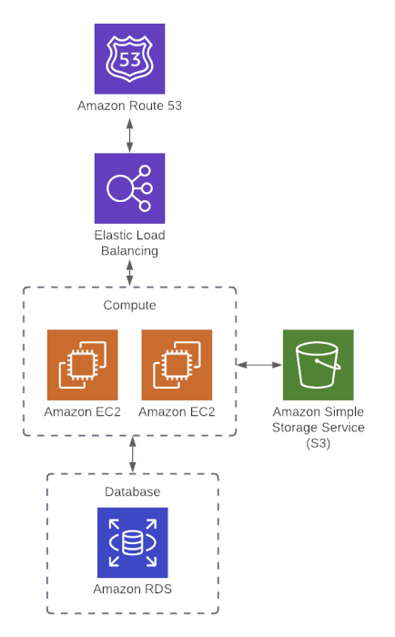

# Terraform & AWS Project

## Overview

This project provisions basic infrastructure on AWS using Terraform.

---

## Content

1. [Overview + Setup](https://github.com/SaadHadadia/Terraform_AWS_tut/tree/first-instance)
1. [Remote Backend Setup](https://github.com/SaadHadadia/Terraform_AWS_tut/tree/remote-backend)
1. [Basics]()
1. [Variables and Outputs]()
1. [Language Features]()
1. [Organization and Modules]()
1. [Managing Multiple Environments]()
1. [Testing]()
1. [Developer Workflows + CI/CD]()

---

## Architecture


---

## Requirements

- Terraform v1.0.0 or higher
- AWS CLI configured with appropriate credentials

---

## Providers

- AWS (default provider)

---

## Modules
This project utilizes the following Terraform modules:

- **DynamoDB:** Provisions DynamoDB tables with configurable capacity and indexes.

- **EC2:** Creates EC2 instances with customizable configurations and networking.
- **RDS:**  Sets up RDS instances for relational databases with various engine support.
- **Route 53:** Manages DNS records and hosted zones for domain name resolution.
- **S3:** Creates S3 buckets with features like versioning, encryption, and lifecycle policies.
- **IAM:** Manages IAM roles, policies, and groups to control access permissions.

---

## Usage

1. Clone the repository:

```bash
git clone <repository-url>
cd <repository-directory>
```

2. Initialize Terraform:

```bash
terraform init
```

3. Apply the configuration:

```bash
terraform apply
```

4. To destroy the infrastructure:

```bash
terraform destroy
```

---

## Author
* This repository was created and is maintained by [Saad Hadadia](https://github.com/SaadHadadia/)